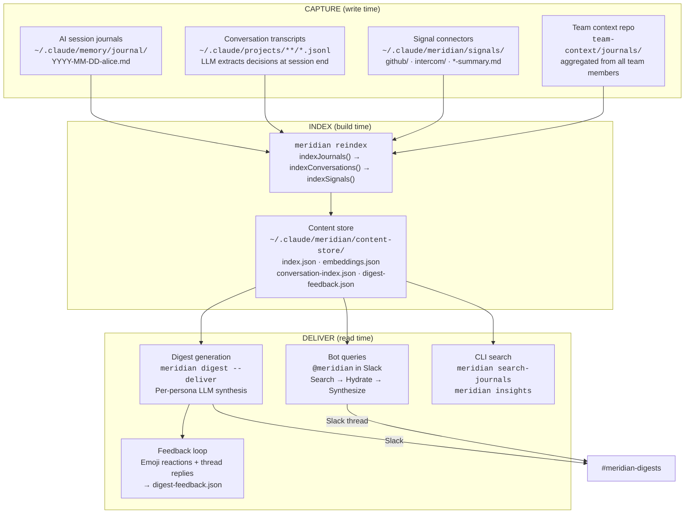
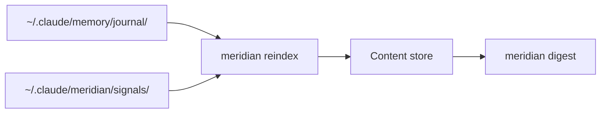
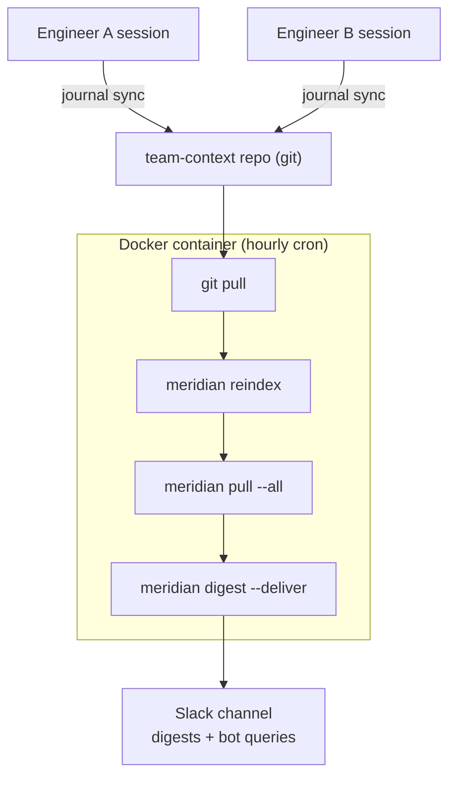

# Data Flow

How data moves through Meridian — from raw engineering activity to actionable team digests and bot answers.

---

## The Big Picture

Meridian has three phases: **capture**, **index**, and **deliver**. Data enters as plain markdown files written during AI coding sessions and pulled from external tools. It gets indexed into a searchable content store. It leaves as persona-targeted digests and bot responses.



---

## Phase 1: Capture

Data enters Meridian from four sources, all as plain markdown files. No databases, no proprietary formats.

### Session journals (primary source)

Engineers use AI coding assistants (Claude Code, Cursor, etc.) with Meridian's session protocol. At session end, the AI writes a journal entry:

```markdown
## api-service — Fix auth token refresh race condition
**Author:** alice
**Why:** Users seeing intermittent 401s after token expiry
**What:** Added mutex around token refresh, fixed retry logic
**Outcome:** No more 401 cascades in staging
**On track?:** Focused
**Lessons:** Token refresh needs to be atomic, not just async
```

Journals are named `YYYY-MM-DD-<author>.md` in `~/.claude/memory/journal/`. The filename slug is the primary author attribution mechanism (with inline `**Author:**` as fallback).

**How it gets there:** The AI writes it during the session-end protocol. No manual steps.

### Conversation transcripts (automatic extraction)

Claude Code stores conversation transcripts as `.jsonl` files in `~/.claude/projects/`. At session end, the stop hook runs:

```
meridian reindex --conversations-only --export
```

This sends each transcript to Haiku (fast, cheap) which extracts decision points. Extracted decisions are written as journal entries for git sync. The extraction is parallelized (max 5 concurrent LLM calls) and incremental (skips unchanged transcripts via content hashing).

**Why this matters:** Engineers don't always write perfect journal entries. Conversation extraction captures decisions that were discussed but might not have made it into the explicit journal.

### Signal connectors (external data)

`meridian pull <channel>` polls external APIs and writes markdown:

| Channel | What it captures | Output location |
|---------|-----------------|----------------|
| GitHub | Issues, PRs, Actions status | `signals/github/<owner>/<repo>/YYYY-MM-DD.md` |
| Intercom | Conversation stats, tags, response times | `signals/intercom/YYYY-MM-DD.md` |
| Notion | Recently updated pages, database entries, comments | `signals/notion/YYYY-MM-DD.md` |

Each channel also produces a `*-summary.md` rollup. The digest prefers rollups over per-repo files to manage token budget.

Connectors follow a standard interface: `configure()`, `pull(since)`, `summarize()`. Adding a new channel means implementing this contract.

**How it gets there:** `meridian pull --all` on cron, or manual `meridian pull github`. In the Docker deployment, the container runs an hourly cron that pulls signals + reindexes.

### Team context repo (multi-engineer aggregation)

For teams with multiple engineers, `meridian journal sync` copies authored journals from each engineer's local `~/.claude/memory/journal/` to a shared Git repo (`team-context/journals/`). The sync command:

1. Auto-migrates plain-date filenames to `YYYY-MM-DD-<author>.md`
2. Copies new/changed files to the team-context repo
3. `git add` + `git commit` + `git push` (with rebase retry on conflict)

The Docker container mounts this repo and runs `git pull` before each reindex cycle, so it sees all team members' journals.

---

## Phase 2: Index

`meridian reindex` builds a unified content store from all three sources. It runs three indexers sequentially:

1. **`indexJournals()`** — Parses `*.md` files from the journal directory. Extracts structured fields (Why, What, Outcome, Lessons, drift status). Detects author from filename slug, inline marker, or file-level marker (three-tier fallback). Computes content hash per entry for incremental updates.

2. **`indexConversations()`** — Scans `.jsonl` transcript files. Sends each to LLM for decision extraction. Tracks processed files in `conversation-index.json` so re-runs skip unchanged transcripts.

3. **`indexSignals()`** — Indexes markdown from `signals/` subdirectories. Tags entries with channel name and section headings.

All three write to the same `index.json` — a single unified index regardless of source. Each entry carries a `source` field (`journal`, `conversation`, or `signal`) so the query layer can distinguish them when needed.

**Embeddings** are generated if `OPENAI_API_KEY` or `AZURE_OPENAI_EMBEDDING_*` vars are set. Stored in `embeddings.json` alongside the index. Backfilled on re-index for entries that were previously indexed without them.

**Repo exclusion:** `MERIDIAN_EXCLUDE_REPOS` filters repos from indexing, so engineers working across multiple teams don't pollute each other's stores.

The index is **incremental**. Content hashing means running `meridian reindex` twice on the same data produces zero updates. This matters for the hourly container cron — most cycles complete in seconds.

---

## Phase 3: Deliver

Three output paths, all reading from the same content store.

### Digest generation

`meridian digest` generates persona-targeted summaries:

1. **Collect** — Queries the content store for entries in the date range. Separates journals/conversations from signals. Falls back to raw file scan if the store isn't indexed yet.
2. **Budget** — Applies a token budget (default 120K chars). Signals get 30% of budget, journals get 70%. Truncates from oldest first.
3. **Generate** — For each persona (Engineering, Product, Design, Strategy), sends the collected data + a persona-specific prompt to the LLM (Sonnet for quality). Each persona gets a different lens on the same underlying data.
4. **Deliver** — `--deliver` posts to Slack via bot token (`chat.postMessage`). Falls back to incoming webhook. Adds a threaded follow-up asking for feedback.

### Bot queries

The Slack bot (`meridian bot`) receives @mentions via Socket Mode:

1. **Search** — Runs the query against the content store (semantic search with embeddings, or full-text fallback). Returns top 5 results.
2. **Hydrate** — Fetches full content for each result (reads the original markdown file).
3. **Synthesize** — Sends results + the user's question to the LLM with a synthesis prompt that teaches author attribution, date awareness, and concise answering.
4. **Reply** — Posts the answer as a Slack thread reply. Supports multi-turn conversation within the thread (includes up to 5 prior exchanges as context).

### CLI search

`meridian search-journals <query>` and `meridian insights` read directly from the content store. Full-text search works with zero API keys. Semantic search requires an embedding API key.

### Feedback loop

After digest delivery, the bot tracks:
- Emoji reactions on the digest message (via `reaction_added`/`reaction_removed` events)
- Text replies in the digest thread
- All stored in `digest-feedback.json`

`meridian digest scores` surfaces this data. The feedback eventually informs digest quality tuning.

---

## Deployment Topologies

### Solo engineer (local)

Everything runs on one machine. Journals are local. Signals pulled via cron. Digest generated on demand. No container needed.



### Team (Docker self-hosted)

Container runs bot + scheduler + auto-indexer. Mounts the team-context repo. Each engineer's session-end hook syncs journals to the shared repo.



---

## Why This Architecture

**Plain files as the data layer.** Every piece of data Meridian touches is a human-readable markdown file in a directory you control. This means: zero infrastructure to provision, `git log` is your audit trail, `grep` works if Meridian breaks, and migrating away means copying a folder.

**Unified index, source-agnostic.** Journals, conversations, and signals all live in one index. A query about "what's happening with billing?" hits Intercom complaints, engineering decisions, and GitHub issues in a single search. The complexity of multiple data sources is absorbed at index time, not query time.

**Incremental everything.** Content hashing at every stage means re-running any operation is cheap. The hourly container cron typically completes in seconds because nothing changed. This makes the system reliable without being expensive.

**LLM at the edges, not the core.** LLMs are used for two things: extracting decisions from conversation transcripts, and synthesizing answers/digests from indexed content. The core data flow — writing files, indexing, searching — has zero LLM dependency. If the LLM is down, search still works, journals still sync, signals still pull.

**Session-end hooks close the loop.** The hardest part of any knowledge management system is getting data in. Meridian solves this by hooking into the AI session lifecycle. When an engineer's coding session ends, the journal writes itself, conversations get extracted, and journals sync to the team repo — all automatically.
